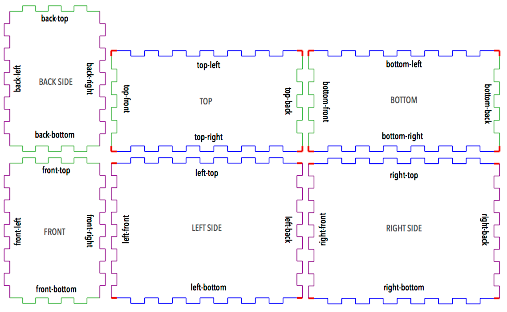
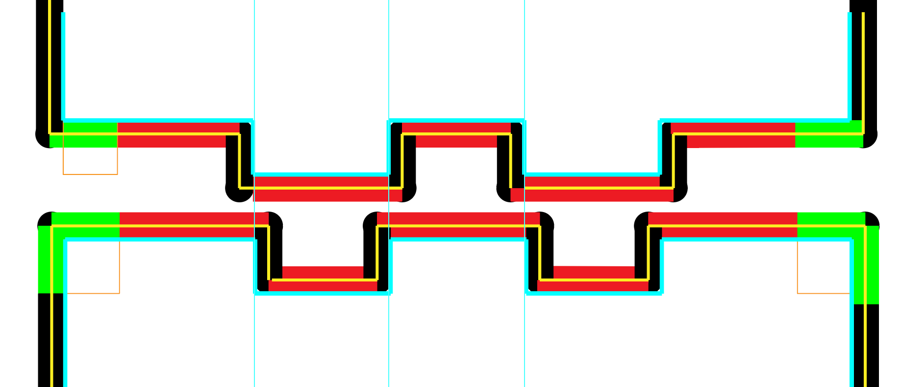

[](https://travis-ci.org/kigster/boxbot)
[](https://codeclimate.com/github/kigster/boxbot/maintainability)
[](https://codeclimate.com/github/kigster/boxbot/test_coverage)

# Boxbot

## NOTE: This gem is not yet finished, and is a work in progress

BoxBot aims to generate an SVG or PDF template that is meant to be used with a laser cutter. Boxbot will generate a 2D cut layout for a 3D box (parallelepiped) with matching tabs that allow the box to be "snapped into place" without screws, although screws and T-joins can also be added. This gem is currently work in progress, and is a rewrite of the [laser-cutter](https://github.com/kigster/laser-cutter) box drawing logic.

## Layouts

The following is an example layout of the box that's 5x4x3 (width, height, depth):



## Kerf

Kerf is the width of the laser-cutting beam. The following diagram depicts how Boxbot generates templates with the non-zero Kerf defined. The yellow line below is where the laser cuts, the red/black are the areas of the material removed by the laser cutter. The light blue is the "desired" shape of the tabs.



## Installation

Add this line to your application's Gemfile:

```ruby
gem 'boxbot'
```

And then execute:

    $ bundle

Or install it yourself as:

    $ gem install boxbot

## Usage

Soon.

## Development

After checking out the repo, run `bin/setup` to install dependencies. Then, run `rake spec` to run the tests. You can also run `bin/console` for an interactive prompt that will allow you to experiment.

To install this gem onto your local machine, run `bundle exec rake install`. To release a new version, update the version number in `version.rb`, and then run `bundle exec rake release`, which will create a git tag for the version, push git commits and tags, and push the `.gem` file to [rubygems.org](https://rubygems.org).

## Contributing

Bug reports and pull requests are welcome on GitHub at https://github.com/kigster/boxbot.

## License

The gem is available as open source under the terms of the [MIT License](https://opensource.org/licenses/MIT).
